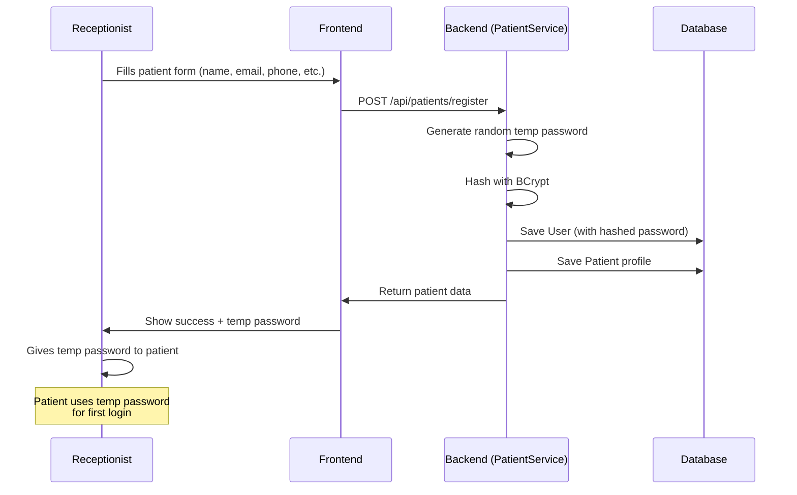

# Module 2: Security — Hardcoded Passwords & the Principle of Least Privilege

## 🎯 WHY — Why This Matters

### The Problem We Found

In `PatientService.java`, when hospital staff registers a patient, the code was:

```java
.passwordHash(passwordEncoder.encode("P@tient@123"))
```

This means **every single patient** registered by staff got the **exact same password**: `P@tient@123`.

### Why is this catastrophic?

1. **One password fits all**: If an attacker discovers this password (by reading the source code, or by being a patient themselves), they can log into **every** staff-registered patient account.

2. **Source code is not secret**: This code is on GitHub. Anyone can read `P@tient@123`.

3. **No accountability**: If a breach occurs, there's no way to know which account was compromised first — they all share the same password.

4. **Password reuse**: Users who don't change their default password remain vulnerable forever.

---

## 🔍 WHAT — What We Changed

### Before (Vulnerable)

```java
User user = User.builder()
    .firstName(request.getFirstName())
    .lastName(request.getLastName())
    .email(request.getEmail())
    .mobileNumber(request.getMobileNumber())
    .passwordHash(passwordEncoder.encode("P@tient@123"))  // ❌ SAME for ALL patients!
    .role(Role.PATIENT)
    .isActive(true)
    .build();
```

### After (Fixed)

```java
// Generate a random temporary password
String tempPassword = UUID.randomUUID().toString().substring(0, 12);

User user = User.builder()
    .firstName(request.getFirstName())
    .lastName(request.getLastName())
    .email(request.getEmail())
    .mobileNumber(request.getMobileNumber())
    .passwordHash(passwordEncoder.encode(tempPassword))  // ✅ UNIQUE per patient
    .role(Role.PATIENT)
    .isActive(true)
    .build();
```

---

## 🛠️ HOW — Step-by-Step Walkthrough

### Step 1: Understanding the Flow

When a **receptionist** registers a new patient at the hospital desk:



### Step 2: How UUID.randomUUID() Works

```java
String tempPassword = UUID.randomUUID().toString().substring(0, 12);
```

Breaking this down:

| Step | Code | Example Output |
|---|---|---|
| 1. Generate UUID | `UUID.randomUUID()` | `f47ac10b-58cc-4372-a567-0e02b2c3d479` |
| 2. Convert to string | `.toString()` | `"f47ac10b-58cc-4372-a567-0e02b2c3d479"` |
| 3. Take first 12 chars | `.substring(0, 12)` | `"f47ac10b-58c"` |

- **UUID** = Universally Unique Identifier (128-bit random number)
- Probability of collision: ~1 in 2^122 (virtually impossible)
- We take 12 characters for a usable temporary password

### Step 3: How BCrypt Hashing Works

```java
passwordEncoder.encode(tempPassword)
// Input:  "f47ac10b-58c"
// Output: "$2a$12$xG9z3KvQr8a1..."  (60-char hash)
```

**BCrypt** does three things:
1. **Adds a random salt** — so identical passwords produce different hashes
2. **Hashes the password** — one-way function, can't be reversed
3. **Uses a work factor** — our config uses strength 12, meaning 2^12 = 4096 iterations

```
Password: "f47ac10b-58c"
         ↓
    [Add random salt: "$2a$12$xG9z3K"]
         ↓
    [Hash 4096 times]
         ↓
Hash: "$2a$12$xG9z3KvQr8a1mNpZ..."  ← stored in database
```

**Why this is secure:**
- Even if someone steals the database, they can't reverse the hashes
- Each password has a unique salt, so identical passwords look different
- The work factor makes brute-force attacks very slow

---

## 📚 Software Engineering Concepts

### 1. Password Hashing vs Encryption

| | Hashing | Encryption |
|---|---|---|
| **Direction** | One-way (can't reverse) | Two-way (can decrypt) |
| **Use case** | Passwords | Data transfer, file storage |
| **Algorithm** | BCrypt, Argon2, scrypt | AES, RSA |
| **Key needed?** | No | Yes (encryption key) |

**Rule**: Always **hash** passwords, never **encrypt** them.

Why? If you encrypt passwords, anyone with the encryption key can decrypt ALL of them at once. With hashing, each password must be cracked individually.

### 2. The Salt Concept

Without salt:
```
"password123" → always produces "abc123..."  ← Attacker builds a lookup table!
"password123" → always produces "abc123..."
```

With salt (BCrypt does this automatically):
```
"password123" + salt1 → "xyz789..."  ← Different every time!
"password123" + salt2 → "def456..."
```

### 3. OWASP Password Guidelines

The [OWASP Authentication Cheat Sheet](https://cheatsheetseries.owasp.org/cheatsheets/Authentication_Cheat_Sheet.html) recommends:

| Guideline | Our Project |
|---|---|
| Use BCrypt, scrypt, or Argon2 | ✅ BCrypt with strength 12 |
| Never store plaintext passwords | ✅ All passwords are hashed |
| Salt every password | ✅ BCrypt auto-salts |
| Don't use hardcoded passwords | ✅ Fixed (was ❌) |
| Implement account lockout | ✅ 5 attempts → 15 min lockout |
| Enforce minimum password length | ⚠️ Could be improved |

### 4. Principle of Least Privilege

This principle states: **Every user should have only the minimum access needed.**

In our context:
- A default password gives ALL patients the SAME access level → violates this principle
- A random temp password ensures each patient has a UNIQUE credential
- Even the staff who creates the account only sees the temp password once

### 5. Defense in Depth Applied

Our password security now has multiple layers:

```
Layer 1: Random temp password (unique per patient)     ← NEW
Layer 2: BCrypt hashing (can't reverse)                ← Already existed
Layer 3: Salt (prevents rainbow table attacks)         ← BCrypt auto
Layer 4: Account lockout (5 failed attempts)           ← Already existed
Layer 5: Rate limiting (5 login attempts/minute)       ← Already existed
```

---

## 🧪 How to Verify

1. **Code check**: Open `PatientService.java` and confirm `"P@tient@123"` is gone
2. **Logic check**: Each call to `registerPatient()` should generate a DIFFERENT password:
   ```java
   // These should produce different hashes:
   UUID.randomUUID().toString().substring(0, 12)  // → "a1b2c3d4-e5f"
   UUID.randomUUID().toString().substring(0, 12)  // → "x9y8z7w6-v5u"
   ```
3. **Security check**: Search the entire codebase for hardcoded passwords:
   ```bash
   git grep -n "P@tient@123"  # Should return NO results
   ```

---

## 📖 Further Reading

- [OWASP: Password Storage Cheat Sheet](https://cheatsheetseries.owasp.org/cheatsheets/Password_Storage_Cheat_Sheet.html)
- [BCrypt explained visually](https://auth0.com/blog/hashing-in-action-understanding-bcrypt/)
- [Java UUID documentation](https://docs.oracle.com/en/java/javase/21/docs/api/java.base/java/util/UUID.html)
- [Spring Security: Password Encoding](https://docs.spring.io/spring-security/reference/features/authentication/password-storage.html)
- [NIST Password Guidelines (SP 800-63B)](https://pages.nist.gov/800-63-3/sp800-63b.html)
