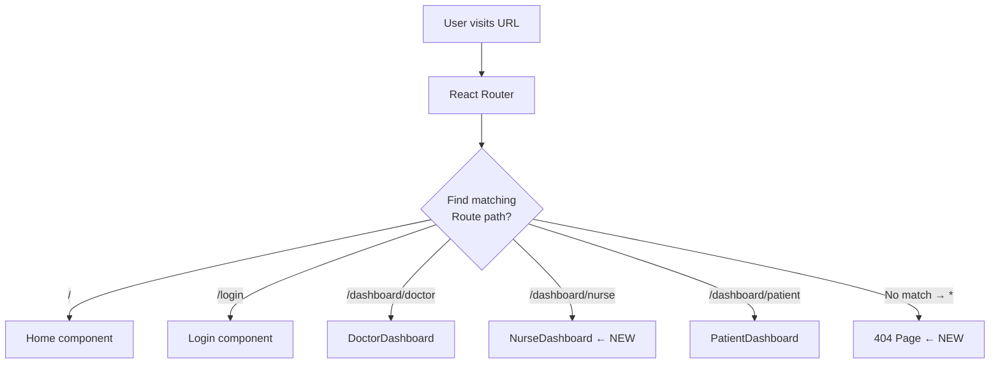

# Module 4: Routing — SPA Navigation & the 404 Pattern

## 🎯 WHY — Why This Matters

### Two Problems Found

**Problem 1: Nurses had no dedicated dashboard route**
Nurses were redirected to `/dashboard/doctor` and shared the Doctor's UI. This meant:
- Nurses saw doctor-specific features they don't need (e.g., prescriptions)
- The dedicated `NurseDashboard.jsx` component was built but never used
- The code existed but was unreachable — a form of "dead code"

**Problem 2: No 404 page**
When a user visits `/dashboard/typo` or any invalid URL:
- **Before**: Blank white screen — no feedback at all
- **After**: Friendly "404 — Page Not Found" with a link to go home

Both problems hurt **User Experience (UX)** — the user doesn't know what happened or what to do next.

---

## 🔍 WHAT — What We Changed

### Change 1: Added NurseDashboard route + import

```diff
 import DoctorDashboard from "./features/dashboard/DoctorDashboard.jsx";
+import NurseDashboard from "./features/dashboard/NurseDashboard.jsx";
 import PatientDashboard from "./features/dashboard/PatientDashboard.jsx";
-import { Routes, Route, useLocation } from "react-router-dom";
+import { Routes, Route, useLocation, Link } from "react-router-dom";
```

### Change 2: Separated Doctor and Nurse routes

```diff
 <Route path="/dashboard/doctor" element={
-    <ProtectedRoute allowedRoles={["DOCTOR", "NURSE", "ADMIN", "SUPER_ADMIN"]}>
+    <ProtectedRoute allowedRoles={["DOCTOR", "ADMIN", "SUPER_ADMIN"]}>
         <DoctorDashboard />
     </ProtectedRoute>
 }/>
+<Route path="/dashboard/nurse" element={
+    <ProtectedRoute allowedRoles={["NURSE", "ADMIN", "SUPER_ADMIN"]}>
+        <NurseDashboard />
+    </ProtectedRoute>
+}/>
```

### Change 3: Updated all NURSE redirects

We updated **4 files** where NURSE was redirected to `/dashboard/doctor`:

| File | Before | After |
|---|---|---|
| `Login.jsx` | `NURSE: "/dashboard/doctor"` | `NURSE: "/dashboard/nurse"` |
| `Signup.jsx` | `NURSE: "/dashboard/doctor"` | `NURSE: "/dashboard/nurse"` |
| `NavbarLanding.jsx` | `NURSE: "/dashboard/doctor"` | `NURSE: "/dashboard/nurse"` |
| `Navbar.jsx` | `if (isNurse) return "/dashboard/doctor"` | `if (isNurse) return "/dashboard/nurse"` |

### Change 4: Added 404 catch-all route

```jsx
{/* Must be LAST in the Routes list */}
<Route path="*" element={
    <div className="text-center p-16">
        <h1 className="text-6xl font-bold text-gray-300 mb-4">404</h1>
        <h2 className="text-xl font-semibold text-gray-100 mb-2">
            Page Not Found
        </h2>
        <p className="text-gray-400 mb-6">
            The page you're looking for doesn't exist or has been moved.
        </p>
        <Link to="/" className="...">Go Home</Link>
    </div>
}/>
```

---

## 🛠️ HOW — Step-by-Step Walkthrough

### How React Router Works

In a **Single Page Application (SPA)**, there's only ONE HTML file. The "pages" are JavaScript components that swap in and out. React Router handles this:

```
User types: /dashboard/patient

1. Browser loads index.html (the ONLY HTML file)
2. React boots up
3. React Router reads the URL: "/dashboard/patient"
4. Finds matching <Route path="/dashboard/patient" />
5. Renders: <PatientDashboard /> component
```



### Why `path="*"` Must Be Last

React Router checks routes **in order**, top to bottom. The first match wins.

```jsx
<Routes>
    {/* If path="*" was FIRST: */}
    <Route path="*" element={<NotFound />} />     {/* Matches EVERYTHING! */}
    <Route path="/" element={<Home />} />          {/* Never reached */}
    <Route path="/login" element={<Login />} />    {/* Never reached */}
</Routes>
```

By placing `path="*"` **last**, it only matches when nothing else did:

```jsx
<Routes>
    <Route path="/" element={<Home />} />          {/* Checked first */}
    <Route path="/login" element={<Login />} />    {/* Checked second */}
    <Route path="*" element={<NotFound />} />      {/* Only if no match above */}
</Routes>
```

### The ProtectedRoute Pattern

Our app uses a **Route Guard** pattern:

```jsx
<Route path="/dashboard/nurse" element={
    <ProtectedRoute allowedRoles={["NURSE", "ADMIN", "SUPER_ADMIN"]}>
        <NurseDashboard />
    </ProtectedRoute>
}/>
```

This creates a decision tree:

```
User visits /dashboard/nurse
        │
        ▼
    Is user logged in?
    ┌───────┴───────┐
    No              Yes
    │               │
    ▼               ▼
 Redirect to    Is role in allowedRoles?
 /login         ┌──────┴──────┐
                No             Yes
                │              │
                ▼              ▼
            Redirect to    Render
            /unauthorized  NurseDashboard ✅
```

### SPA vs Traditional (MPA) Routing

| Feature | SPA (React) | MPA (Traditional) |
|---|---|---|
| Page loads | One HTML, swap components | New HTML per page |
| URL changes | JavaScript updates URL bar | Browser requests new page |
| Speed | Instant transitions | Full page reload |
| 404 handling | Client-side catch-all route | Server returns 404 status |
| SEO | Harder (needs SSR) | Natural |
| Backend | API-only (REST) | Renders HTML |

Our project is an **SPA** — the backend only serves JSON data via REST APIs.

---

## 📚 Software Engineering Concepts

### 1. Separation of Concerns

Each role should have its **own dashboard** with only the features they need:

```
DOCTOR  → DoctorDashboard  → Prescriptions, Diagnoses, Lab Reports
NURSE   → NurseDashboard   → Vitals Recording, MAR, Clinical Orders
PATIENT → PatientDashboard → My Records, Appointments, Bills
```

Putting nurses into the doctor dashboard **violates Separation of Concerns** — the nurse sees tools they shouldn't use, and the doctor dashboard becomes cluttered.

### 2. The DRY Principle (Don't Repeat Yourself)

We had the same redirect mapping (`NURSE: "/dashboard/doctor"`) in **4 different files**. When we changed the route, we had to update all 4. This is a sign we should extract it into a shared constant:

```javascript
// A better approach (future improvement):
// src/config/routes.js
export const ROLE_DASHBOARDS = {
    SUPER_ADMIN: "/dashboard/admin",
    ADMIN: "/dashboard/admin",
    DOCTOR: "/dashboard/doctor",
    NURSE: "/dashboard/nurse",
    PATIENT: "/dashboard/patient",
    // ...
};
```

Then import this constant in Login.jsx, Signup.jsx, etc. — one source of truth.

### 3. Dead Code Detection

`NurseDashboard.jsx` was a fully built component (10,898 bytes!) that was **never imported** anywhere. This is called **dead code** — code that exists but can never execute.

**How to detect dead code:**
- Search for the filename in imports: `grep -r "NurseDashboard" --include="*.jsx"`
- Use a bundler's tree-shaking feature
- Use ESLint rules like `no-unused-modules`

### 4. The Principle of Least Astonishment

Users expect that visiting an invalid URL shows a helpful error page, not a blank screen. The **Principle of Least Astonishment** (also called Principle of Least Surprise) states:

> The system should behave in a way that the user expects. If there's no page at this URL, show a clear "not found" message.

---

## 🧪 How to Verify

1. **Test nurse route**: Log in as a NURSE → should redirect to `/dashboard/nurse`
2. **Test 404**: Visit `http://localhost:5173/nonexistent` → should show "404 — Page Not Found"
3. **Test doctor route still works**: Log in as a DOCTOR → should still go to `/dashboard/doctor`
4. **Test route guard**: As a PATIENT, try visiting `/dashboard/nurse` → should redirect to `/unauthorized`

---

## 📖 Further Reading

- [React Router v7 Documentation](https://reactrouter.com/)
- [SPA vs MPA Architecture](https://developer.mozilla.org/en-US/docs/Glossary/SPA)
- [Route Guards Pattern](https://reactrouter.com/en/main/start/concepts#route-protection)
- [Separation of Concerns (Wikipedia)](https://en.wikipedia.org/wiki/Separation_of_concerns)
- [DRY Principle](https://en.wikipedia.org/wiki/Don%27t_repeat_yourself)
